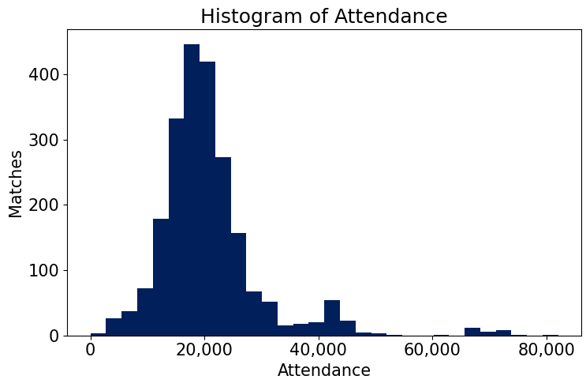
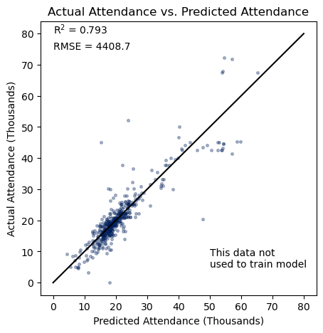
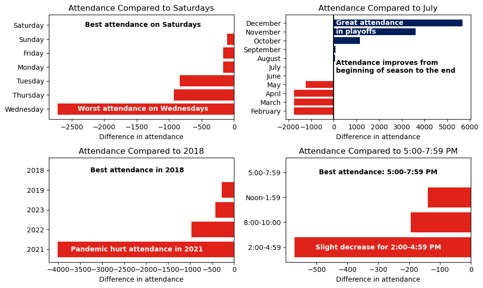
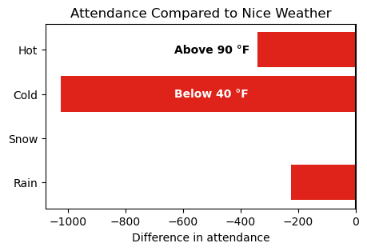
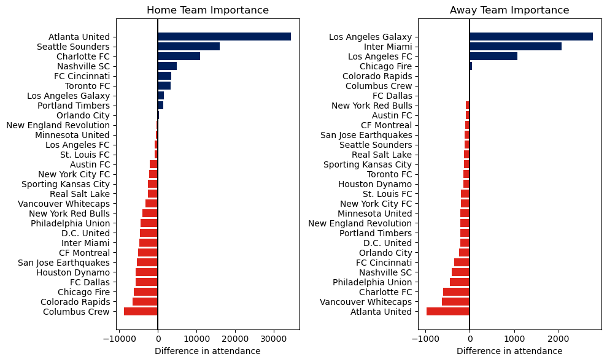
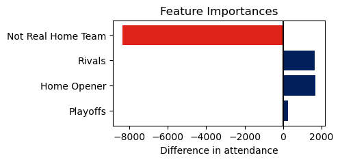

# Analyzing Attendance in Major League Soccer

## Overview

## Business Problem
Major League Soccer (MLS) is the top professional soccer league in the United States and Canada. It began play in 1996 and has been a driving force in growing the sport of soccer in the U.S. ever since.

A major source of income for a league and its teams is ticket sales. MLS exists in a crowded sports landscape in which it competes with both other professional sports and college sports. Avoiding competing head-to-head with the National Football League (NFL) is a major reason that MLS starts its season in late February and ends in early December, out of phase with most other soccer leagues worldwide which start in August and end in May.

**The goal of this project is to determine when MLS should hold their matches in order to maximize in-person attendance.**

## Stakeholder
The primary stakeholder for this project is the MLS front office which makes the decisions in regards to scheduling. I also think that other outdoor sports leagues, particularly in the United States and Canada, could get some useful insights from this work.

## Data
**Match data**: Match data was collected from FBref.com (FBref stands for Football Reference). I used the seasons from 2018 to 2023, but excluded the 2020 season because almost every match was played without fans in attendance due to the COVID-19 pandemic. The data from FBref.com includes the following information:

1. Round of season. This means either regular season or a specific round of the playoffs.
2. Date.
3. Day of the week.
4. Home and away team.
5. Final score.
6. Stadium.
7. Attendance.

The figure above represents the attendance of the 2,229 matches used in this project. Many teams have stadiums with capacities between 20,000 and 25,000, so there is a significant peak around 20,000. However, some teams share huge stadiums with NFL teams, so there are some matches with much higher attendance.

I also collected some supplementary information about each team which can be found in the supplementary_data folder. The files in that folder contain information about the latitude and longitude of each stadium, their capacity, and which teams are rivals. It also contains some attendance data that was missing from FBref.com, but was present on the official MLS website.

**Weather data**: Weather data was collected using the API made available at open-meteo.com. For each match, I collected the following information:

1. Temperature in degrees Fahrenheit.
2. Rainfall.
3. Snowfall.
4. Cloud cover.
5. Windspeed.
6. Windgust speed.

I used the measurements that were taken at the top of the hour closest to kick-off time. I also measured the amount of rain and snow that happened prior to kick-off on the day of each match.

## Model
I tried out four different types of models for this project:

1. Linear regression.
2. Extreme Gradient Boosting (XGBoost) regression.
3. Random forest regression.
4. K-Nearest Neighbors regression.

The best performing instance of each model is summarized in the table below.

| Model               | RMSE (Test) | $R^2$ (Test) | RMSE (Training) | $R^2$ (Training) |
|---------------------|-------------|--------------|-----------------|------------------|
| XGBoost             | 4,408.7     | 0.793        | 2,685.7         | 0.917            |
| Random Forest       | 4,650.8     | 0.770        | 2,289.8         | 0.940            |
| Linear Regression   | 5,012.6     | 0.733        | 4,752.0         | 0.740            |
| K-Nearest Neighbors | 8,131.9     | 0.207        | 0.0             | 0.000            |

The best performing model was the XGBoost model that achieved an RMSE of 4,408.7 and $R^2$ of 0.793 on the test data. The XGBoost model did have some overfitting, but still performed better on the test data than any of the other models.

**Everything below will refer to the best XGBoost model.**

The plot above shows the actual attendance vs. the predicted attendance for the test dataset.

## Results

The goal of this project is to understand what factors affect attendance and how large the effect is. I estimated the effect of each feature by inputting fake data to the model, changing one feature at a time to see how the predicted attendance changed. The fake data includes each team playing at home and away against each other team. The fake data also assumes that all matches are played on a Saturday at 7:30 pm in July, 2023, with good weather conditions by default.

### When should matches be held?

First, let's use this as an example of how the estimation works. All of the matches are set to Saturday by default. If I want to see how the attendance changes if the matches are played on Wednesday instead, I just change all of the matches to Wednesday and get a new prediction. The bar in the top-left graph for Wednesday is how much the average attendance changed by switching from Saturday to Wednesday.

**Day of the week**: According to the model, the best day to hold matches is on Saturday since the average attendance decreases by switching to any other day. The worst days were Wednesday, Thursday, and Tuesday. A match on a Wednesday is expected to get about 2,800 fewer fans than a Saturday match, a significant decrease.

**Month**: The attendance improved as the season progressed. The best attendance happened in November and December which got much higher attendance than other months. I think the primary reason these months had higher attendance is because the playoffs happen in November and December. I also think that is why attendance improved from February to October; the playoff picture becomes clearer as the season progresses, making the stakes of each regular season game higher.

**Year**: The attendance in 2021 was about 4,000 lower than in 2018. This was certainly a result of the COVID-19 pandemic (note: matches that did not allow any fans were removed from the dataset, but matches that had reduced capacity for safety reasons are still included).

**Time of Day**: While the model considers matches starting between 5:00-7:59 pm to be the best, the attendance was not heavily affected by changing the kick-off time. I would still consider early kick-offs to be a bad choice for weekdays.

### Does weather matter?

**Temperature**: Matches with a temperature below 40 degrees Fahrenheit are predicted to have about 1,000 fewer people on average. This reinforces the choice MLS made to avoid playing matches in winter.

**Precipitation**: There is no strong evidence that rain or snow had a strong effect on attendance. However, this could be partly due to low sample size.

### Home team and away team

**Home team**: The three teams with the highest attendance (Atlanta, Seattle, and Charlotte) all share stadiums with an NFL team. While this is not an option for every team, this does seem to provide evidence that this is a strong option for teams that can do this. However, it is not a guarantee of success. The New England Revolution and Chicago Fire also currently share large stadiums with NFL teams, but the former has average attendance and the latter has the third worst attendance in the league.

**Away team**: The three teams that tend to get the highest attendance when they play on the road are the Los Angeles Galaxy, Inter Miami, and Los Angeles FC. I think a major reason for these teams driving attendance is their star power. With players like Lionel Messi, Javier Hernandez, and Carlos Vela, these teams have some of the most recognizable stars in the league. A more detailed analysis would be required to confirm whether star players are important for attendance, but this is at least point in that direction.

### Other factors

**Not real home team**: On a few occasions, a team is forced to play a "home" match away from their home stadium. The effect on attendance is huge. The average attendance is about 8,000 lower when this happens.

**Rivalries**: Matches played between rivals are predicted to get 2,000 more fans.

**Home openers**: While the model indicates that February and March have the worst attendance, the exception seems to be home openers (a team's first home match of the season). The model predicts that home openers get about 2,000 more fans on average.

**Playoffs**: Earlier, I argued that playoffs help drive attendance, and yet the model predicts a very small increase in attendance for playoff matches. The reason for this is because the increase in attendance is already reflected by what month a match is played. All matches in November and December are playoff games (with a few also happening in late October).

## Recommendations

|**Weekends better than midweek**:|
|:--------------------------------------------------------------------------------|
|The model indicated that matches played on Wednesdays get about 2,700 fewer fans than Saturday matches and Tuesdays/Thursdays get almost 1,000 fewer fans. Attendance would improve if MLS could play more of their matches on weekends rather than midweek.   It is impossible to avoid playing some midweek matches because there simply aren't enough weeks during the season for the teams to play all their matches on the weekend, but there are steps MLS can take to improve the situation. Currently, MLS teams also compete in a few other competitions: the US Open Cup, the CONCACAF Champions Cup, and the Leagues Cup. The latter two competitions are somewhat redundant since they are both competitions that include teams from other North American countries (the Champions Cup is all of North America while the Leagues Cup is an MLS vs. Liga MX competition). At least in 2023, a big reason teams had to play so many midweek matches is because the Leagues Cup forced MLS to pause its season for a full month. This wouldn't be such a problem if the Leagues Cup was well attended, but the average was just 17,257, significantly lower than MLS matches. Even worse, some teams were eliminated from the Leagues Cup after the first week, meaning they didn't play a match for about three weeks. I think MLS should reconsider the format of the Leagues Cup, particularly if it is worth it to pause MLS for such a long time. Without the Leagues Cup, MLS would have gotten back about 5 weekends.|
|**Make regular season matter**:|
|The attendance improved from the beginning of the season to the end of the season. I think a big part of this trend is that matches become more intriguing as the playoffs approach because the stakes of each match get bigger. People want to watch matches that matter. The problem is that many fans feel like most of the regular season does not matter that much because so many teams make the playoffs, so a team does not actually have to perform that well to qualify. In most European leagues, a team has to finish with the best overall record to be crowned champion, but in MLS, over half of the teams qualify for the playoffs (in 2023, 18 teams out of 29 make the playoffs). Sporting Kansas City provides a great example of how low the bar is. In their first 10 matches, they got 0 wins, 3 ties, and 7 losses. This was the worst 10 match beginning to a season in history, and yet they recovered to make the playoffs, then proceeded to beat the 1-seed in the West, St. Louis FC. This shows that a team can perform quite poorly, but still make the playoffs. Then the team just needs to go on a hot streak to make a run in the playoffs.  The relative importance of regular season matches would increase if fewer teams made the playoffs, but this also comes with a downside. The fewer playoff spots there are, then the earlier teams will be eliminated from playoff contention. Once a team is unable to make the playoffs, their matches cease to matter.  I do have an idea for a compromise between number of teams making the playoffs and rewarding teams for finishing higher in the standings. In the Australian Football League (AFL), which plays Australian rules football, they have a format in which the top 8 teams make the playoffs, but the top 4 start with a pretty significant advantage (click this link for the exact details: https://en.wikipedia.org/wiki/AFL_final_eight_system). I think this format would do a good job of allowing enough teams into the playoffs while still rewarding the best-performing teams.|
|**Favor warmer cities in winter**:|
|The model indicated that matches with temperatures below 40 degrees Fahrenheit had about 1,000 fewer fans on average. This seems to support the decision made by MLS to not play matches during most of the winter. The conditions would be even worse if MLS tried to hold matches in January and early February. Presumably, the attendance would also drop further.  MLS is forced to play some matches in February. Otherwise, they would not have enough time to actually play all of the matches they have scheduled. MLS could improve overall attendance by favoring warmer cities, meaning cities at lower latitude, during the first couple weeks of the year. This means playing February matches in places like Los Angeles, Houston, and Miami rather than places like Minnesota, New York, and Toronto.|
|Other Considerations:|
|**Sharing stadium with NFL team**:|
|The three teams with the highest overall attendance (Atlanta United, Seattle Sounders, and Charlotte FC) all share a stadium with an NFL team. Their advantage is pretty obvious: they have a larger stadium that they can utilize when demand is high. One argument against having a huge stadium is that the fan experience is not as fun when the stadium is less than half full, but this is not a big issue in my opinion. When there is not enough demand to fill the whole stadium, teams just sell tickets for the sections closest to the field, making for a similar environment as a smaller stadium.  While the top three teams in attendance indicate that having a larger stadium is better, it is not a guarantee of success. The Chicago Fire moved out of their smaller stadium in 2020 to move back into Soldier Field, which they share with the Chicago Bears of the NFL. The move has not led to a significant increase in attendance. This could possibly be due to the stadium being less easily accessible than the stadiums in Atlanta or Seattle or possibly just because the Fire have not been competitive for a long time.  I would not recommend that a team that already has their own stadium abandon it to move into a larger stadium. However, I do think this is an option that future expansion teams should explore. For example, if Phoenix or Las Vegas are awarded expansion teams, they should strongly consider using the stadiums owned by the Cardinals and Raiders of the NFL. They would have the potential for higher attendance and they would not have to pay to build a new stadium.|
|**Promote rivalries**:|
|The model indicates that rivalry matches get about 2,000 more people on average. I think MLS would benefit from promoting these rivalries, but I would caution that they should not try to manufacture rivalries. Instead, they should make sure announcers and articles on their website highlight the history between teams. A good recent example of this is FC Cincinnati and the New York Red Bulls. They are not close enough geographically to be automatic rivals, but a rivalry was kindled when a player switched from Cincinnati to New York, leaving with some not so kind words for his former club. These are the kinds of things that can spark animosity between fanbases.|

## Contents of Repository
|File/Folder                        | Description                                                    |
|:----------------------------------|:---------------------------------------------------------------|
|modeling.pdf                       | PDF of modeling notebook.                                      |
|mls_attendance.pdf                 | PDF of the non-technical presentation for stakeholders.        |
|environment.yml                    | Python environment used for the project.                       |
|notebooks                          | Folder of notebooks and supporting functions                   |
|--modeling.ipynb                   | Jupyter notebook for creating models.                          |
|--data_exploration.ipynb           | Jupyter notebook for exploring the data.                       |
|--model_funcs.py                   | File containing functions for making, evaluating models.       |
|--exploration_visuals.py           | File containing functions for exploring data.                  |
|--collect_match_weather_data.ipynb | File containing functions for collecting data.                 |
|--gather_data.py                   | File containing functions for collecting data.                 |
|supplementary_data                 | Folder containing supplementary data.                          |
|--mls_stadiums.xlsx                | Excel file containing information about MLS stadiums.          |
|--mls_rivals.xlsx                  | Excel file containing information about MLS rivals.            |
|--missing_attendance.xlsx          | Excel file containing corrections to attendance/stadium data.  |
|images                             | Folder containing images used in the presentation and README.  |

Contact: email: david.eric24@gmail.com       linkedIn: https://www.linkedin.com/in/david-schenck-data/